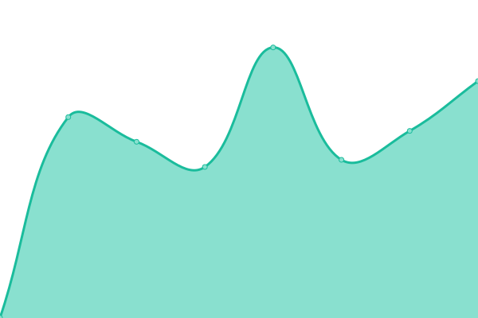

# [📈 Live Status](https://herrphon.github.io/upptime): <!--live status--> **🟧 Partial outage**

This repository contains the open-source uptime monitor and status page for [Alexander von Renteln](https://herrphon.github.io/upptime), powered by [Upptime](https://github.com/upptime/upptime).

With [Upptime](https://upptime.js.org), you can get your own unlimited and free uptime monitor and status page, powered entirely by a GitHub repository. We use [Issues](https://github.com/herrphon/upptime/issues) as incident reports, [Actions](https://github.com/herrphon/upptime/actions) as uptime monitors, and [Pages](https://herrphon.github.io/upptime) for the status page.

<!--start: status pages-->
<!-- This summary is generated by Upptime (https://github.com/upptime/upptime) -->
<!-- Do not edit this manually, your changes will be overwritten -->
<!-- prettier-ignore -->
| URL | Status | History | Response Time | Uptime |
| --- | ------ | ------- | ------------- | ------ |
|  Auth-Bridge | 🟥 Down | [auth-bridge.yml](https://github.com/herrphon/upptime/commits/HEAD/history/auth-bridge.yml) | 

 0ms
     
 | 

<a href="https://upptime.phon.name/history/auth-bridge">0.00%</a>
    

|  Auth-Bridge - Test 1 | 🟥 Down | [auth-bridge-test-1.yml](https://github.com/herrphon/upptime/commits/HEAD/history/auth-bridge-test-1.yml) | 

 0ms
     
 | 

<a href="https://upptime.phon.name/history/auth-bridge-test-1">0.00%</a>
    

|  Software Center | 🟩 Up | [software-center.yml](https://github.com/herrphon/upptime/commits/HEAD/history/software-center.yml) | 

 407ms
     
 | 

<a href="https://upptime.phon.name/history/software-center">100.00%</a>
    

|  Software Center - Test 1 | 🟥 Down | [software-center-test-1.yml](https://github.com/herrphon/upptime/commits/HEAD/history/software-center-test-1.yml) | 

 433ms
     
 | 

<a href="https://upptime.phon.name/history/software-center-test-1">59.77%</a>
    

|  Wetrack | 🟩 Up | [wetrack.yml](https://github.com/herrphon/upptime/commits/HEAD/history/wetrack.yml) | 

 587ms
     
 | 

<a href="https://upptime.phon.name/history/wetrack">100.00%</a>
    

|  Weshare | 🟩 Up | [weshare.yml](https://github.com/herrphon/upptime/commits/HEAD/history/weshare.yml) | 

 937ms
     
 | 

<a href="https://upptime.phon.name/history/weshare">100.00%</a>
    

|  [Scortum](https://scortum.com) | 🟥 Down | [scortum.yml](https://github.com/herrphon/upptime/commits/HEAD/history/scortum.yml) | 

 0ms
     
 | 

<a href="https://upptime.phon.name/history/scortum">0.00%</a>
    

|  [Google](https://www.google.com) | 🟩 Up | [google.yml](https://github.com/herrphon/upptime/commits/HEAD/history/google.yml) | 

 79ms
     
 | 

<a href="https://upptime.phon.name/history/google">100.00%</a>
    

<!--end: status pages-->

[**Visit our status website →**](https://herrphon.github.io/upptime)

## 📄 License

- Powered by: [Upptime](https://github.com/upptime/upptime)
- Code: [MIT](./LICENSE) © [Alexander von Renteln](https://herrphon.github.io/upptime)
- Data in the `./history` directory: [Open Database License](https://opendatacommons.org/licenses/odbl/1-0/)
